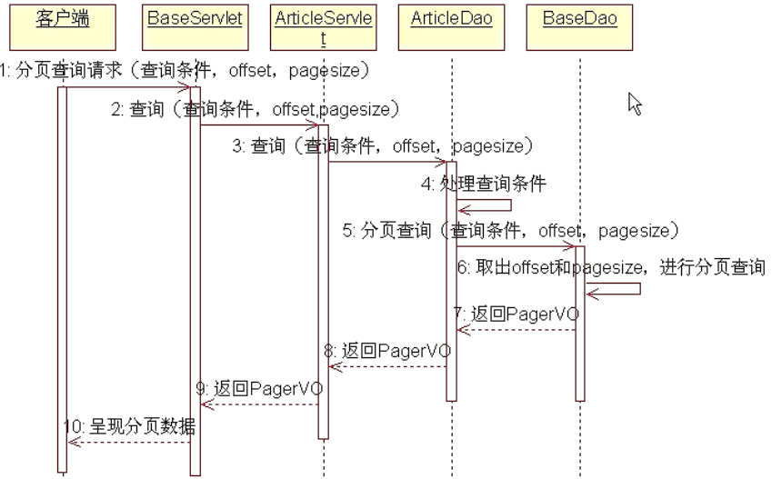
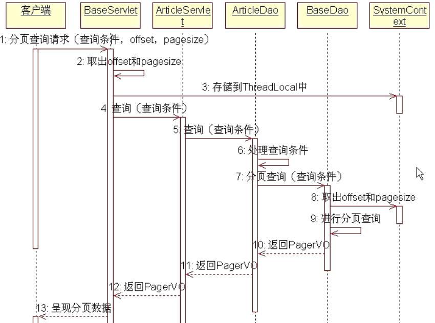

# CMS

## 第一个大版本：初步完成CMS需求

###  login 中的 checkcode

第一步：

打开登录页面，显示验证码


浏览器通过 *get* 方法来递交请求，所以 servlet 可以只实现 `doGet` 方法。然后servlet 通过流将图片返回到 response 中。

那么思考一下，checkcode 的适用范围，是需要写死还是灵活一点，肯定是灵活一点，多少位，只显示数字，只显示英文？所以需要可配置化。对于一个servlet要实现可配置，可以实现一个 `init` 方法，把可配置信息放在 servlet 配置文件里面。

### 登录

第二步：

用户从登录页面向系统提交用户名、密码和验证码
        系统判断验证码是否正确
        系统判断用户名是否存在，判断密码是否正确

如果验证码不正确，返回登录页面，显示提示信息“验证码不正确”
        如果用户名不存在，返回登录页面，显示提示信息“用户名不存在”
        如果密码不正确，返回登录页面，显示提示信息“密码不正确”

------------
访问数据库：

注册数据库驱动
获取Connection对象(url,用户名,密码)
通过Connection对象和一条SQL语句创建Statement/PreparedStatement对象
执行SQL语句
关闭ResultSet
关闭Statement
关闭Connection

有很多请求，因为是在一个session中而不是一个http请求周期中，所以要把生成后的验证码放在session中，让其他servlet拿到

forward 发生在服务器端，两个页面拿到的request是同一个

sendredirect 重新访问一个新的页面，两个页面使用的是不同的request

但是，直接访问<http://localhost:8080/CMS_war/backend/main.jsp> 也是可以的，所以需要在登录的servlet中，在用户登录成功以后，在session中进行记录，这样当浏览器直接访问main.jsp时，如果没有登录将无法访问。


### 登出

清除session中所有参数。


### 添加文章


### 编辑文章


将数据库操作逻辑封装到DAO中，首先实现DAO接口，然后对接口进行相应实现。使得具体的servlet不依赖于具体代码的实现。

利用抽象工厂设计模式，及使用配置文件来避免因为变化所产生的影响

DAO对象不包含状态，只是纯粹的操作，即使多个线程同时访问同一个DAO对象，也完全没有问题，
所以，没有必要每次访问DAO，都创建一个DAO对象。因此，在PropertiesBeanFactory中初始化所有的bean，每次getBean，只是直接返回一个已经初始化好的对象即可！


那么如果把PropertiesBeanFactory设计成单例模式，就可以多个Servlet共用一个DAO，但是实现的思路可以不仅仅是将PropertiesBeanFactory这个类设计成单例模式，因为单例模式实际上又使得DAO依赖于具体的实现，因为我可以从properties来创建，也可以通过xml文件来创建，我们希望获取DAO对象的时候应该只看得到BeanFactory，至于使用哪种配置文件，则去到一个统一的位置去配置好。这样的实现有很多种，那么这里采用Servlet的<load-on-startup>，在tomcat启动时就初始化DAO在之后供Servlet使用

完成PropertiesBeanFactory只创建后，我们发现再具体的Servelt使用时仍需

```java
BeanFactory factory = (BeanFactory) request.getServletContext().getAttribute(InitBeanFactoryServlet.DAO_FACTORY);
ArticleDao articleDao = (ArticleDao) factory.getBean("ArticleDao");
articleDao.addArticle(a);
```

那么实际上在servlet中，我们仍需要自己去拿需要的Dao，那么可不可以直接用呢，在Servlet中声明属性ArticleDao就可以直接使用呢？答案是使用DI注入

利用DI（Dependency Injection） - 依赖注入，将Servlet的依赖关系注入到Servlet中！实现的手段则是通过HttpServlet中的Service方法，这个方法是当HTTP请求到达servlet 时候首先调用的，简单理解就是决定了调用servlet的doGet还是doPost等等。

现在我们的Servlet都是直接继承HttpServlet，而我们需要的是Http请求在到达对应的Servlet之前将所有的Dao送到Servlet那里，所以我们再写一个BaseServlet类它继承HttpSetvlet并重写service方法，然后其他Servlet再继承BaseServlet，这样就可以实现提前将Servlet 中需要的Dao送到Servlet的效果。

那么，如何重写service方法才能实现这个效果呢？也就是说，如何在BaseServlet的service方法中，知道是哪个对象调用了service方法以及设置这个对象中的一些属性呢？这就自然想到了反射机制！

```java
public class BaseServlet extends HttpServlet {
    @Override
    protected void service(HttpServletRequest req, HttpServletResponse resp) throws ServletException, IOException {
        System.out.println(this);//这里的this是多态的，也就是说后面继承BaseServlet的类，在HTTP到达的
        					   //时候会调用servce方法，那么这是this的运行时类型是继承的类型。
        BeanFactory beanFactory = (BeanFactory) req.getServletContext().getAttribute(InitBeanFactoryServlet.DAO_FACTORY);

        Class clazz = this.getClass();
        Method[] methods = clazz.getMethods();
        for(Method method:methods) {
            if(method.getName().startsWith("set")) {
                // 利用setXXX() 方法的方法名，因为XXX一般就是对象的一个属性（因为一般都是用ide直接依靠属性名生成set和get方法）
                // 那么这个属性名，一般也对应配置文件中的名字
                // 这样就相当于约定，一般认为 约定大于配置
                String propertyName = method.getName().substring(3);
                Object bean = beanFactory.getBean(propertyName);
                try {
                    method.invoke(this, bean);
                } catch (IllegalAccessException e) {
                    e.printStackTrace();
                } catch (InvocationTargetException e) {
                    e.printStackTrace();
                }
            }
        }
        super.service(req, resp);
    }
}
```

### 减少servlet数量

把article相关的servlet都放在一个里面 ，继续利用BaseServlet，产生一个统一的调用函数，并且用反射机制去调用请求的方法。

为了减少Servlet的数量，我们设定从界面中传递一个method参数，根据这个参数的取值，利用反射机制，调用Servlet的方法，比如对于文章管理那些众多的Servlet：AddArticleServlet、DelArticlesServlet、OpenUpdateArticleServlet、UpdateArticleServlet、SearchArticlesServlet

我们将这些Servlet合成为一个Servlet：ArticleServlet，ArticleServlet的基本结构如下：
```java
public class ArticleServlet extends BaseServlet{
	//这个方法执行查询功能
	public void execute(HttpServletRequest request,HttpServletResponse response){...}
    //这个方法执行添加功能
    public void add(HttpServletRequest request,HttpServletResponse response){...}
    //这个方法执行删除功能
    public void del(HttpServletRequest request,HttpServletResponse response){...}
    //这个方法执行打开更新界面的功能
    public void updateInput(HttpServletRequest request,HttpServletResponse response){...}
    //这个方法执行更新功能
    public void update(HttpServletRequest request,HttpServletResponse response){...}
}
```
在BaseServlet中，根据界面传递过来的参数method的取值，利用反射机制调用不同的方法即可！

### 解决Servlet重写init的小问题

当重写init(ServletConfig)方法的时候，记得调用super.init(ServletConfig)，调用super.init(ServletConfig)的目的，主要是由于在父类（GenericServlet）中，有一个ServletConfig实例变量，super.init(ServletConfig)就是给这个实例变量复制。

这样，再后续的getServletContext()操作，才可以拿到ServletContext对象: GenericServlet的部分源代码如下所示：

```java
public abstract class GenericServlet implements Servlet, ServletConfig, java.io.Serializable {

	private transient ServletConfig config;

    public void init(ServletConfig config) throws ServletException {
        this.config = config;
        this.init();
    }
    public void init() throws ServletException {
    }    
    public ServletConfig getServletConfig() {
        return config;
    }
    public ServletContext getServletContext() {
        return getServletConfig().getServletContext();
	}
｝
```

### 第一阶段完成的内容

1. 完整实现了ArticleServlet、ChannelServlet、LoginServlet
   - 将与Article有关的Servlet全部合成到ArticleServlet类中
   - 将与Channel有关的Servlet全部合成到ChannelServlet类中

1. 定义了接口ArticleDao、ChannelDao，AdminDao，以及他们的sql实现
   - 将与Article有关的数据库操作全部放到ArticleDao中
   - 将与Channel有关的数据库操作全部放到ChannelDao中
   - 将与Admin有关的数据库操作全部放到AdminDao中
2. 创建了Article，Channel，Admin实体类
   - 


创建了Admin实体类，t_admin数据库表，并创建了AdminDao接口

## 第二个大版本

### 利用 MyBatis 替换手写 JDBC 

现在直接点击添加是直接转向 add_Article.jsp，但是现在不能这样，因为需要先经过一个 Servlet 先查询到所有 Channel 放到 request 中，然后再转向 add_Article.jsp 才能拿到所有的 Channel。那么由于前面将所有的 Article 的Servlet 都整合在了一起，现在只需要在其中添加一个新的方法就可以了。

### 导入本地jar包

在使用Maven的情况下，idea导入本地包，不放入Maven本地仓库

首先通过 File ---> Project Structure ---> Modules ---> 点击“+”号，添加jar包。然后选中新添加的，点击 apply。之后再去 Artifacts 中找到 XXX：war exploded 下的  Output Layout 看到右侧有 Available Elements 把新添加的包部署到 WEB-INF 的 lib 下就可以了

### 文章添加修改


### 文章更新修改

文章修改时需要考虑到对于频道的更新，根据以前的更新流程是：

- 拿到文章id -----> 查询文章 -----> 打开更新页面 -----> 更新内容 -----> 更新成功页面

大致流程不需要进行变化，但是中间的细节没有考虑完全：

1. 查询文章时没有拿到相应的关联频道信息；

   - 可以通过 [MyBatis](https://www.cnblogs.com/kenhome/p/7764398.html) 的 resultMap 进行复杂的映射，在查询文章时将关联信息放到 channels 中

   - ```xml
         <resultMap id="mappingChannel" type="Article">
             <!-- 其他的字段可以自动进行映射，因为名字都是对应的 -->
             <id property="id" column="id"/>
             <collection property="channels" column="id" ofType="Channel" select="searchChannel">
                 <!-- 还可以在对查询到的集合中POJO对象的属性和字段再进行映射 -->
             </collection>
         </resultMap>
         <select id="findArticleById" parameterType="int" resultMap="mappingChannel">
             select * from t_article where id=#{id}
         </select>
         <select id="searchChannel" parameterType="int" resultType="Channel">
             select * from t_channel c, t_channel_article ca where ca.articleId = #{id} AND c.id = ca.channelId
         </select>
     ```

2. 更新内容时不光要更新 t_article 表，还有 t_channel_article 表；

### 对add和update中请求参数封装

一般在开发过程中，从jsp中得到的参数名称和POJO对象中的属性名称是一致的，此时可以利用JAVA的反射机制进行赋值；

通过 request.getParameterMap 得到所有参数的 Map 其中 key 是参数名称，value 是参数的值（是String[]类型，只有一个值也是长度为1的String[]）,这就涉及到了类型转换，因为POJO对象的属性还有很多其他类型。如果不借助其他工具，自己手写的思路是：

> 1. 首先拿到所有参数；
> 2. 根据名称，去找POJO对象中相关属性，并查找有没有赋值方法setXxxx()；
> 3. 通过反射机制，查看setXxx()需要什么类型；
> 4. 转换类型，赋值；

这里则使用其他工具，apache-commons-BeanUtils 就是对 Java 反射封装的类库。具体使用方法见代码中 BeanUtilsTest 类。遍历 HashMap 的四种[方式1](https://www.jianshu.com/p/f6a60ef2861d)和[方式2](https://www.cnblogs.com/qianjinyan/p/10537736.html)

### 对 DAO 进一步封装

#### 创建父类BaseDao

简单利用创建父类来减少重复代码，其实封装就是把重复的部分抽离出来，再将变化的东西作为参数送入进去。那么要封装好，需要遵守一些命名规则：

>1. MyBatis的namespace要取实体类的全路类名
>2. Mybatis的语句id要遵守一些规则，例如CRUD的操作，添加就是add，删除就是del

分页较为复杂，那么封装的时候，可以规定由子类去传入需要用到的查询语句id，以及需要的参数。

#### 利用ThreadLocal去掉参数

<center>未封装前的调用层次</center>

我们需要将offset和pageSize参数去掉，减少后续方法的传递层次：

<center>用TreadLocal封装后的过程</center>

使用ThreadLocal去除分页时需要的offset和pageSize参数。实际上在不考虑多线程的情况下，可以通过写一个类 SystemContext 里面添加两个静态属性 offset，pageSize。这样在需要的位置提前设置好值，需要用的时候直接拿出来用。然而在**多线程情况下**，如果只有这一份变量，便会涉及并发修改同一个变量的问题。所以，利用ThreadLocal为每一个线程创建一份变量。

### 用服务器端include技术制作首页

#### 最直观的流程

对于首页，一个直观的流程是：

> 1. 访问一个Servlet，在Servlet中将首页需要的全部查询出来
> 2. 重定向到index.jsp
> 3. 在jsp中将查询结果显示出来。

那么这个流程涉及到的问题就是：

> 1. 如果首页的布局发生变化，需要重新修改大量查询的代码；
> 2. 首页中布局，以及转向到其他页面布局大多数是**重复的**，例如：多个频道下虽然显示的文章是不相同的，但是这些文章的布局是相同的。

#### 利用服务端include实现

1. 网站的首页，频道的首页，文章的详细显示页面
2. 在查看文章的详细信息时，【相关文章】功能的列表显示
    - 创建一个关键字和文章的关联表t_article_keyword，表中两个字段：articleId和keyword
    - 当插入文章之后，按照keyword（空格或逗号分隔），向关联表插入记录，每个关键字一条记录
   	- 查询相关文章的时候，首先根据文章的关键字，查出所有相关文章的ID，然后根据ID
   	列表查询出文章的标题来！
    - 如果文章被删除，则文章和关键字之间的关联信息也要被同时删除


使用注解配置[Servlet](https://www.cnblogs.com/stAr-1/p/7424270.html)

